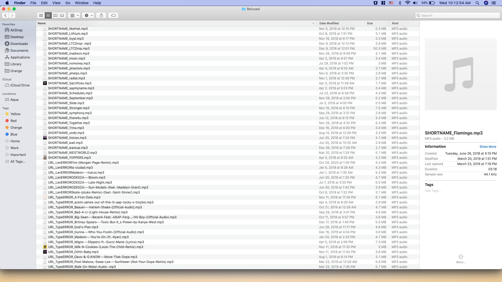

# Album Artwork for Mac Screensaver

This script might be very niche, but I have gotten great use out of it and wanted to use it as a portfolio builder.

I don't use iTunes, but have a ton of random mp3 files from DJing and making mixes. I wanted these files to have album artwork so that I could use
the "Album Artwork" screensaver on my Mac. 

&nbsp;-------

Basically, it takes the name of a .mp3 file, say:

&nbsp;&nbsp;&nbsp;&nbsp;&nbsp;&nbsp;**lotus-eater-pluko-flip(1).mp3**

and searches for that exact name on SoundCloud. It removes any dashes, underlines, and anything else that might prevent the correct result from showing. Because of
this, it only searches for songs with logical names. Files like:

 &nbsp;&nbsp;&nbsp;&nbsp;&nbsp;&nbsp;**hir0.mp3** or **aaf83hge9g.mp3**
 
 will not be searched.
 
 
 
 It then clicks the first search result and saves that image. Right now, and due to the ambiguity of some of the file names, there is no distinction between what is
 the correct album artwork and what is not. But, assuming that the file name was specific enough, the file will be moved out of the original music folder and into a
 new, modified one.
 
 
 
 If the process results in an error, the file will be moved to a refused folder, changing the name of the file to show what kind of error it encountered. Also, if 
 the name of the file is too short, the file is moved to the refused folder, as well.
 
 
 
 After downloading the image, it then adds the ID3 data such as the album and artist. iTunes requires an album and artist name for the artwork to be included
 in the screensaver. For this, the code just attaches random words as fillers, see below.
 
 
 
 If the script runs enough times and the results are satisfactory, the screensaver shows all of the artwork in the iTunes lobby, leading to a very aestetically 
 pleasing monitor display while away from keyboard. 
 
 
 
 Thanks for viewing.
 
 &nbsp;-------
 
 ### File Path Naming Conventions
 
 If you do end up running this file, below are the main paths that you would need to edit. 
 
&nbsp;&nbsp;&nbsp;&nbsp;&nbsp;&nbsp;**org_musicfolder** is the folder that holds all of your music files

&nbsp;&nbsp;&nbsp;&nbsp;&nbsp;&nbsp;**ref_musicfolder** is the folder that will hold the refused files

&nbsp;&nbsp;&nbsp;&nbsp;&nbsp;&nbsp;**artfolder** is the folder that will hold all of the art files

&nbsp;&nbsp;&nbsp;&nbsp;&nbsp;&nbsp;**driver_path** is the folder that holds the ChromeDriver file***

&nbsp;&nbsp;&nbsp;&nbsp;&nbsp;&nbsp;**new_musicfolder** is the folder that will hold all of the new music files with artwork 
 
&nbsp;

***It should be noted that the code makes use of Selenium's ChromeDriver, so the actual driver file must be downloaded on your computer.
